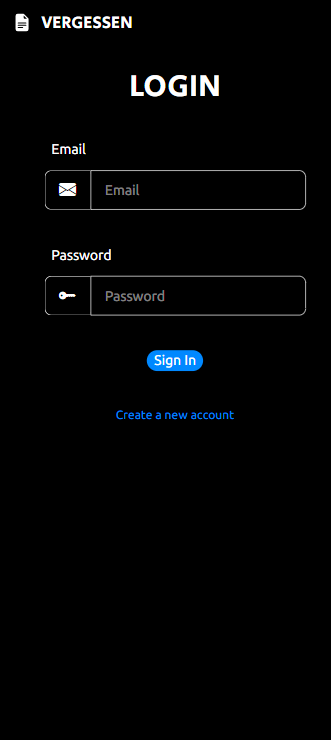
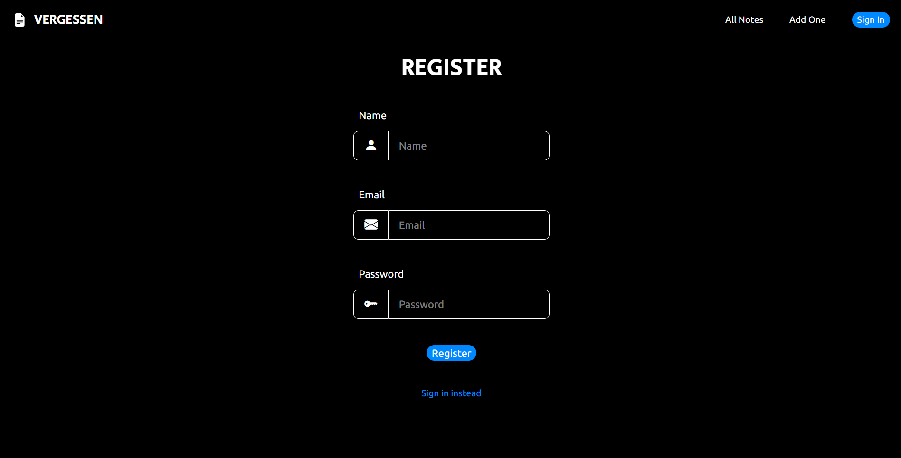
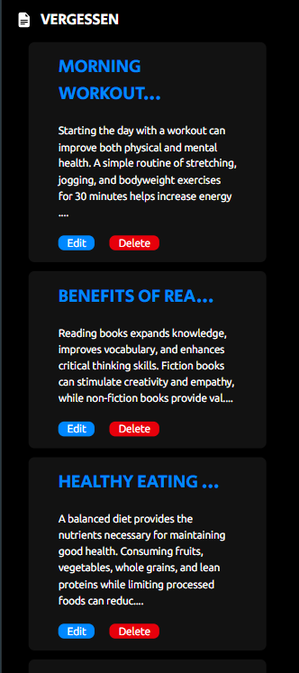
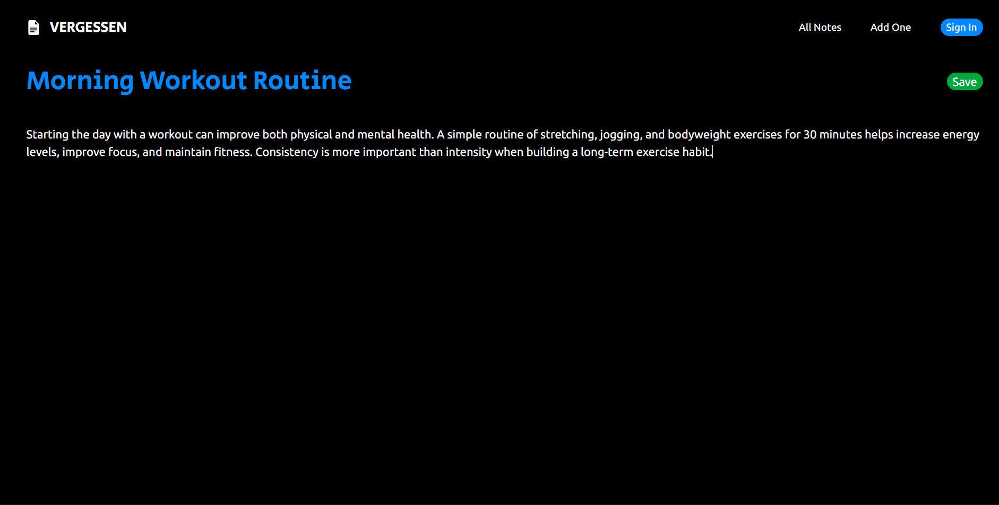
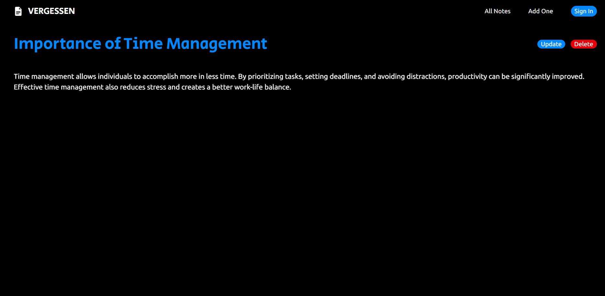

# 📝 Vergessen

Vergessen is a modern note-taking application built with **React**, **Vite**, **JavaScript**, and **Tailwind CSS**. It allows users to create an account, sign in, and manage their notes through a clean and responsive interface.

The name **Vergessen** comes from the German word meaning *"to forget"*. The application helps users store important information in one place so they never have to worry about forgetting it.

---

## ✨ Features

### 🔐 Authentication
- User Registration
- User Login
- Session-based access to notes

### 📝 Notes Management
- Create Notes
- View Notes
- Edit Notes
- Delete Notes

### 📱 Responsive Design
- Mobile Friendly
- Desktop Friendly

### 🎨 Modern Interface
- Dark Theme UI
- Clean and Minimal Design

---

## 🛠️ Tech Stack

### Frontend
- React
- Vite
- JavaScript
- Tailwind CSS

### Backend
- REST API (External Backend Server)

---

## 📂 Project Structure

```bash
src/
├── Components/
│   ├── DisplayCard.jsx
│   ├── Error.jsx
│   ├── Header.jsx
│   └── UpdateContext.jsx
│
├── Pages/
│   ├── Home.jsx
│   ├── Login.jsx
│   ├── NewNote.jsx
│   ├── Note.jsx
│   └── Register.jsx
│
├── App.jsx
├── App.css
├── index.css
└── main.jsx
```

---

## 🚀 Installation

### Clone the Repository

```bash
git clone https://github.com/bothrayash276/Vergessen.git
```

### Move into the Project Directory

```bash
cd vergessen
```

### Install Dependencies

```bash
npm install
```

### Create Environment Variables

Create a `.env` file in the root directory:

```env
VITE_BACKEND=your_backend_api_url
```

### Run the Development Server

```bash
npm run dev
```

The application will start on:

```bash
http://localhost:5173
```

---

## 📖 Usage

### Create an Account
1. Navigate to the Register page.
2. Enter your details.
3. Create your account.

### Sign In
1. Enter your email and password.
2. Click **Sign In**.

### Create a Note
1. Click **Add One**.
2. Enter the title and content.
3. Save the note.

### Edit a Note
1. Open an existing note.
2. Click **Edit/Update**.
3. Modify the content.
4. Save changes.

### Delete a Note
1. Open a note.
2. Click **Delete**.

---

## 📸 Screenshots

### Login Page



### Register Page



### Home Page



### Create or Edit Note



### Note Details



---


## 👨‍💻 Author

**Yash Bothra**